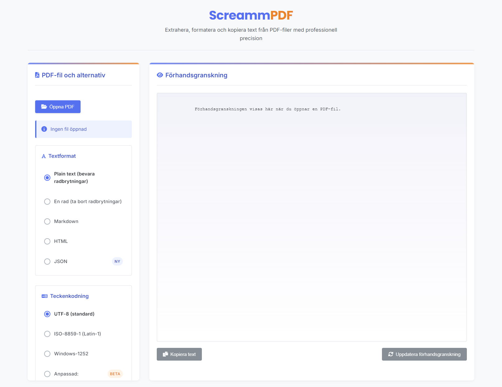

# ScreammPDF

<div align="center">
  <!-- Enklare titeldesign utan extern ikon -->
  <h1>ScreammPDF</h1>
  <h3>Extract, Format, and Copy Text from PDF Files with Professional Precision</h3>
</div>

<p align="center">
  
  
  
  
</p>

## 🌟 Features

ScreammPDF is an elegant desktop application for extracting and processing text from PDF documents:

- **Powerful Text Extraction**: Extract text while preserving document structure and formatting
- **Multiple Format Options**: Export as plain text, one-line text, Markdown, HTML, or JSON
- **Responsive Design**: Optimized interface that adapts to different screen sizes
- **Text Processing Options**: Trim, normalize whitespace, and convert case as needed
- **Character Encoding Support**: UTF-8, Latin-1, Windows-1252, and custom encoding options
- **Portable Application**: No installation required - run directly from any location

## 📋 Application Preview

<div align="center">
  
</div>


## 🚀 Getting Started

### Using the Portable Version

1. Download the latest release from the Releases page
2. Extract the ZIP file to a location of your choice
3. Run `ScreammPDF.exe` or `ScreammPDF.bat` to start the application

#### On Windows with PowerShell

If you're using PowerShell, you can use the included script to start the application:

```powershell
# From the project root directory
.\start-app.ps1
```

### Development Setup

```bash
# Clone the repository
git clone https://github.com/username/ScreammPDF.git

# Navigate to the project directory
cd ScreammPDF

# Install dependencies
npm install

# Start the application
npm start
```

## 🔧 Building From Source

ScreammPDF provides multiple build options for different distribution needs:

### Simple Portable Build

Creates a basic portable structure with a start file.

```bash
npm run build:simple
```

### ZIP Archive

Creates a ZIP file containing the application and all required files.

```bash
npm run build:zip
```

### Self-Extracting Archive (Windows)

Creates a self-extracting EXE file using 7-Zip (requires 7-Zip to be installed).

```bash
npm run build:sfx
```

### NSIS Installer (Windows)

Creates a professional installer using NSIS (requires NSIS to be installed).

```bash
npm run build:nsis
```

## 📖 User Guide

1. Click on "Open PDF" to select a PDF file
2. Once the file is loaded, the extracted text will appear in the preview pane
3. Select your desired format options (Plain Text, One Line, Markdown, HTML, or JSON)
4. Apply any text processing needed (trim, normalize, case conversion)
5. Click "Copy Text" to copy the processed text to your clipboard
6. Use "Update Preview" to apply changes to the format options

## 🧰 Tech Stack

- **Electron**: Cross-platform desktop application framework
- **JavaScript**: Core programming language
- **pdf-parse**: Library for extracting text from PDF files
- **HTML/CSS**: User interface styling with responsive design

## 🤝 Contributing

Contributions are welcome! Please feel free to submit a Pull Request.

1. Fork the project
2. Create your feature branch (`git checkout -b feature/amazing-feature`)
3. Commit your changes (`git commit -m 'Add some amazing feature'`)
4. Push to the branch (`git push origin feature/amazing-feature`)
5. Open a Pull Request

## 📝 License

This project is licensed under the MIT License - see the [LICENSE](LICENSE) file for details.

## 📞 Contact

Project created with Electron and pdf-parse for high-quality text extraction from PDF files.

## 💖 Support the Project

If you find ScreammPDF useful, please consider supporting its development. Your donations help maintain the project, add new features, and improve documentation.

<div align="center">
  <p>Support options will be available soon!</p>
</div>

Every contribution is deeply appreciated and helps ensure ScreammPDF remains a high-quality, free tool for everyone.

---

<div align="center">
  <sub>Built with ❤️ for the PDF extraction community</sub>
</div> 